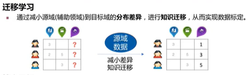

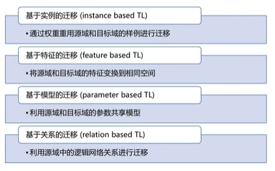

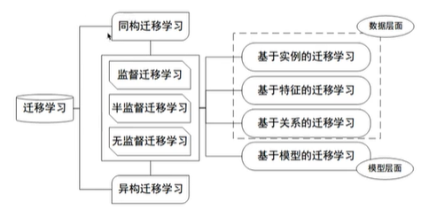

---

# 形式化

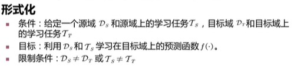

---

## 领域自适应问题

### 描述

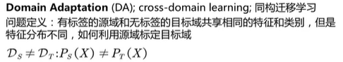

特征的分布不一样，维度一样

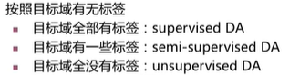

### 解决

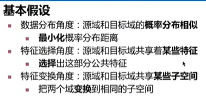 

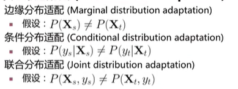

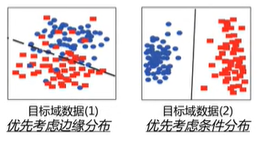

边缘分布反映整体分布

条件分布表示细致的形状

---

#### 边缘分布

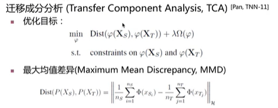

令距离最小就完事了

这个“距离”是最大均值差异

扩展：

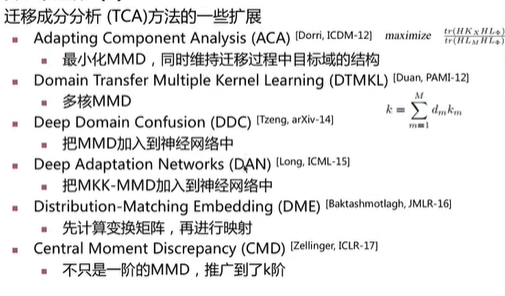

#### 条件分布适配

比较少

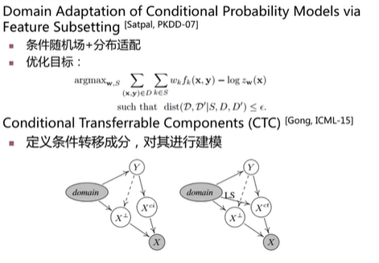

---

### 联合分布适配

两个都适配

问题：怎么获得条件分布？喏：

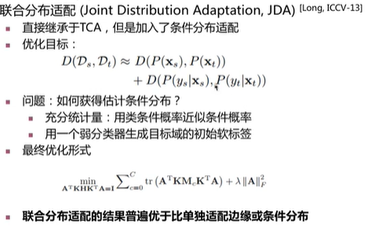

扩展：

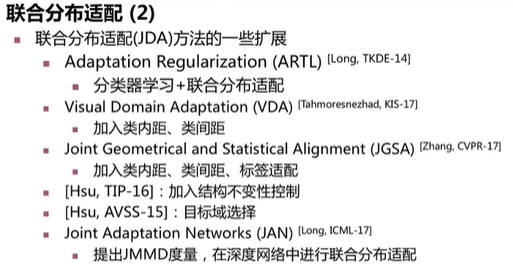

JGSA是当时公开数据中最好的

联合分布适配的问题：

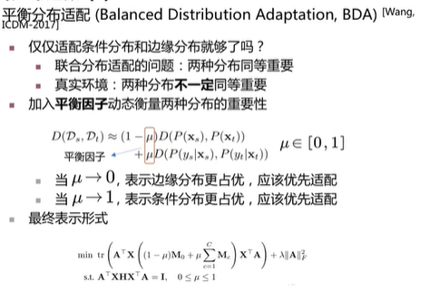

两个方面的权重

$\mu$是超参数？可训练参数？

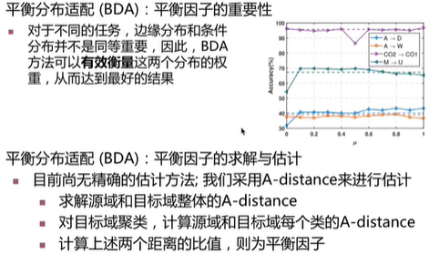

##### 总结：

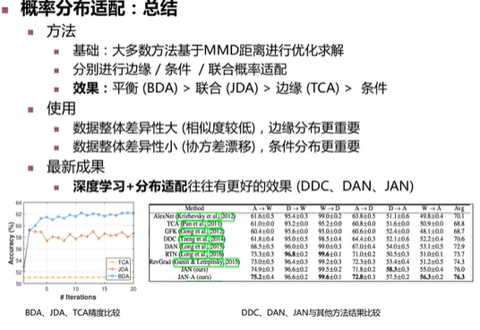

**深度学习+** 相对要好

#### 特征选择法

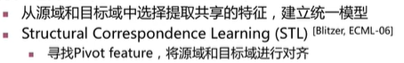

**SCL**

找出轴特征并进行对齐

#### 扩展：

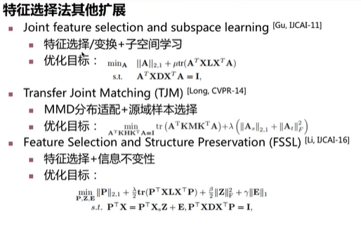

加了很多项

或者把分类器也

这部分研究一般和别的方法结合

#### 子空间学习法

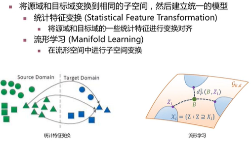

:warning:流形

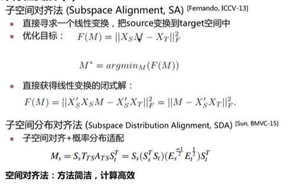

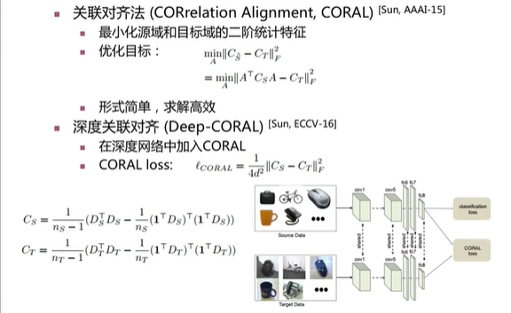

##### 流形

在空间上把domain抽象成两个点，画一条最短距离（测地线）

取有限的点或无穷的点（积分

别的方法：

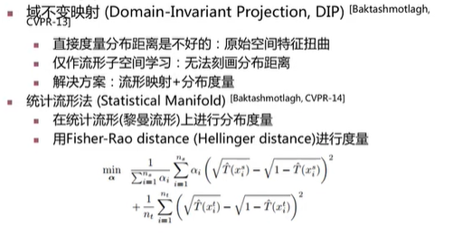

#### 总结

---

## 最新（2017）研究成果

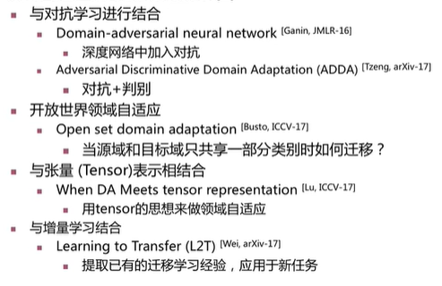

---

没了
